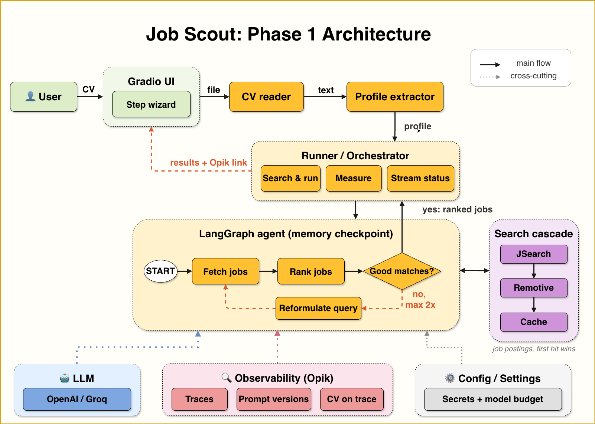

# The Observable Job Agent
## Job Scout: a real AI agent you can see inside

<div align="center">
  <h3>Build an AI job-matching agent, and the observability to trust it</h3>
  <p>Upload your CV (PDF). Get real job openings ranked 0–100 for fit, each with an honest explanation of what matches and where your gaps are.</p>
  <p>Master the most in-demand AI engineering skills: <strong>LLM agents (LangGraph)</strong> and <strong>LLM observability (Opik / LLMOps)</strong></p>
</div>

<p align="center">
  
  
  
  
  
  
</p>

</br>

<p align="center">
  
</p>

## 📖 About This Project

**Job Scout** is a real, observable AI agent you run on your own machine. Upload
your CV and it extracts a structured profile, searches real job openings, and
ranks each with a **fit score (0–100)** plus an honest explanation of the match
and the gaps. Every LLM and tool call is traced in
[Opik](https://www.comet.com/docs/opik/) from the very first run.

It is the first entry in *The Observable Job Agent*, a series that builds one
agent while building the ability to see inside it: **Build → Evaluate →
Self-Improve**.

> **🎯 The observability difference:** most tutorials add telemetry at the end.
> We don't. The agent gets instrumented *before* it gets good, so cost, latency,
> and quality are measurable from run one. The whole series builds on that
> decision.

> **The human applies. The agent never submits applications.** The bottleneck in
> a job hunt is the research and tailoring per application, not clicking submit.
> That is the part worth automating.

### 🧭 What You'll Build

- **End-to-end agent:** CV (PDF) → typed profile → LLM-driven job search → batched fit ranking → a bounded reformulation loop
- **LLM-driven tool use:** the model chooses the search arguments; your code executes them, and you can watch it choose in the trace
- **Full Opik tracing on every run:** a span tree per node, an auto-drawn agent graph, per-run cost, the CV attached to the trace, and versioned prompts — all from one line of code
- **A Gradio interface** with streamed progress and a run footer (cost, latency, deep link to the trace)
- **Multi-source job search** (JSearch, Adzuna, Remotive, offline cache) that runs with **zero API keys**
- **An honest baseline**: run it at scale, measure everything, document the weaknesses ([`docs/phase1_findings.md`](docs/phase1_findings.md)), and resist fixing them too early


## 🚀 Quick Start

### 📋 Prerequisites

- **Python 3.12+**
- **[uv](https://docs.astral.sh/uv/getting-started/installation/)** package manager
- API keys are **optional** — the app runs with none.

### ⚡ Get Started

```bash
# 1. Clone this part's release
git clone //will get add in future
cd observable-job-agent

# 2. Install
uv sync --all-groups

# 3. Configure (all keys optional)
cp .env.example .env

# 4. Verify (no network, no credits)
make test

# 5. Launch the app, then upload a CV from data/fixture_cvs/
make app
```

**Runs with zero keys** via Remotive + a committed offline cache. Add keys when
you want live international jobs, real ranking, and tracing. Every key has a free
path — see [`docs/opik_setup.md`](docs/opik_setup.md).

**Default model** is `openai:gpt-4o-mini`. Swap it with one env var: `SCOUT_MODEL`
(e.g. `groq:llama-3.3-70b-versatile` for free, or `ollama:llama3.2` for local).
Free models correctly show $0.00 cost in Opik.

### 📊 Access Points

| Service | URL | Purpose |
|---------|-----|---------|
| **Gradio UI** | http://localhost:7860 | Upload a CV, review the profile, find ranked jobs |
| **Opik dashboard** | your Comet project | Span tree, agent graph, per-run cost, prompt library |

---

## 🏗️ Architecture

CV extraction is a preprocessing step (`job_scout.profile`) that produces a typed
`Profile`; the graph takes that profile and focuses on finding jobs:

```
extract_profile(cv) → Profile ─┐
                               ▼
     START → fetch_jobs → rank_jobs → [enough good matches?]
                ↑                            │ no
                └──── reformulate_query ◄────┘   │ yes → END
```

- **`fetch_jobs`** is an LLM tool-calling node: the model *chooses* the `search_jobs` arguments (query, country, remote).
- **`rank_jobs`** scores postings in batches of 5, one structured-output call per batch, capped at 25 jobs.
- **`reformulate_query`** broadens the search if fewer than 5 jobs score ≥ 60, bounded to at most 2 loops. That conditional edge is what makes this an agent rather than a straight-line workflow.

The search fans out over **JSearch** (primary, city-level), **Adzuna**
(international), **Remotive** (keyless remote), and a **committed offline cache**.
Full walkthrough: [`docs/architecture.md`](docs/architecture.md). Adding a source:
[`docs/extending_sources.md`](docs/extending_sources.md).

---

## 🔧 Reference

### 🛠️ Technology Stack

| Component | Purpose |
|-----------|---------|
| **LangGraph** | The agent graph + conditional reformulation loop |
| **LangChain** | `init_chat_model`, LLM-driven tool calling |
| **Opik / Comet** | Observability: traces, per-run cost, versioned prompts |
| **Gradio** | Three-step wizard UI with streamed progress |
| **Pydantic + pydantic-settings** | Typed schemas and configuration |
| **httpx + pypdf** | Job-source HTTP and CV reading |
| **Job sources** | JSearch, Adzuna, Remotive, committed offline cache |

**Development tools:** uv, Ruff, Pytest, pre-commit.

### 🏗️ Project Structure

```
observable-job-agent/
├── src/job_scout/
│   ├── app.py          # Gradio three-step wizard UI
│   ├── runner.py       # run orchestration shared by UI + batch (tracing, cost, latency)
│   ├── profile.py      # CV text → Profile (pre-graph extraction)
│   ├── config.py       # Settings (pydantic-settings, SecretStr keys)
│   ├── llm.py          # chat-model factory + per-run call budget
│   ├── tracing.py      # all Opik wiring in one module
│   ├── graph/          # graph.py, state.py, schemas.py, nodes/, prompts/
│   └── tools/          # jobs_api.py (JSearch/Adzuna/Remotive/cache), cv_reader.py
├── scripts/            # run_batch.py, snapshot_jobs.py, generate_fixture_cvs.py
├── data/               # cached_jobs.json, fixture_cvs/ (4 synthetic CVs)
├── docs/               # architecture.md, opik_setup.md, extending_sources.md,
│                       # phase1_findings.md, baseline.json
└── tests/              # 35 tests (LLM mocked, network mocked, Opik off)
```

### 🔧 Essential Commands

```bash
make setup       # uv sync + pre-commit hooks
make app         # launch the Gradio app
make batch       # baseline batch (prints projected cost; add --yes to run)
make snapshot    # rebuild data/cached_jobs.json from live sources
make fixtures    # regenerate the synthetic fixture CVs
make test        # run the test suite (35 tests)
make lint        # ruff check
make format      # ruff format + fix
```

### 🎓 Target Audience

| Who | Why |
|-----|-----|
| **AI/ML Engineers** | Learn production agent architecture and LLMOps beyond tutorials |
| **Software Engineers** | Build an end-to-end LLM agent with observability baked in |
| **Data Scientists** | See how to measure an AI system honestly before optimizing it |

---

## 🛠️ Troubleshooting

- **No jobs / all `source: cache`** — you have no live-source keys, or the network is blocked. Expected; the cache is the offline fallback. Add Adzuna/JSearch keys and re-run `make snapshot`.
- **Cost shows $0.00** — you're on a free model (Groq/Ollama). Opik prices only OpenAI/Anthropic/Google models.
- **No traces in Opik** — check `OPIK_ENABLED=true` and that `OPIK_API_KEY` / `OPIK_WORKSPACE` are set. See [`docs/opik_setup.md`](docs/opik_setup.md).

---

## 💰 Cost

Reproducing everything in Part 1 costs **under $0.50** with API models, or is
**fully free** with local models (Ollama) or free tiers. The app runs with zero
keys via Remotive + the offline cache.

---

<div align="center">
  <h3>🎉 Ready to build an agent you can actually trust?</h3>
  <p><strong>Clone it, <code>make app</code>, and drop in a fixture CV.</strong></p>
  <p><em>Built with love by <a href="https://www.linkedin.com/in/shirin-khosravi-jam/">Prashant Yadav</a></em></p>
</div>

---


